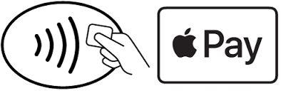

# Pagare con lo smartphone

Le applicazioni e i servizi di seguito permettono di utilizzare lo smartphone per pagare attraverso il POS.
Apple Pay funzionalità disponibile per i dispositivi con sistema operativo IOS prodotti da Apple o molto più semplicemente i dispositivi che dietro riportano il logo della mela.
Google Pay disponibile per gli altri smartphone, ovvero quelli con sistema operativo Android.
Consapevoli che si storce un po’ il naso al pensiero di mettere dati sensibili sullo smartphone parliamo anche di sicurezza e cosa fare in caso di furto o smarrimento del device.

| Caratteristiche di entrambe le App |
| ------------------------------- |
| Completamente in Italiano |
| Gratuite
| Non sono presenti pubblicità |
| Facili e abbastanza intuitive da utilizzare |

## Apple Pay dispositivi IOS

L’applicazione che rende possibili i pagamenti in mobilità è Wallet, in italiano si traduce con portafoglio. 
Prima di vedere come aggiungere una carta è bene precisare quali modelli supportano questa funzionalità. 
Apple Pay è supportato da tutti i dispositivi con Touch ID (lettore di impronte digitali) o Face ID (Riconoscimento Facciale).

Per aggiungere una carta a Wallet dopo aver aperto l’applicazione sarà necessario toccare il simbolo con il + in alto a destra. Nella nuova schermata sarà possibile scansionare la carta inquadrandola con la fotocamera e i dati verranno presi automaticamente o si potranno inserire manualmente; dopo l’inserimento si dovrà toccare su avanti. La banca o l’istituto che ha emesso la carta verificherà i tuoi dati e potrà richiedere maggiori informazioni, se necessarie per la verifica della carta; dopo che le verifiche saranno effettuate sarà necessario toccare un’ultima volta su avanti e la procedura sarà conclusa. Nella home dell’app sarà visualizzata un’anteprima della carta e le attività in ordine cronologico, ovvero gli ultimi pagamenti fatti con Apple pay; è importante precisare che non troveremo tutte le operazioni fatte con la carta, ma solamente quelle fatte utilizzando Apple Pay.

**Pagare con Apple Pay**
Le procedure da seguire sono le seguenti, se il dispositivo supporta il Face ID premere due volte il tasto laterale, quindi guardare lo schermo dell’iPhone per autenticarsi  oppure inserire il codice; altrimenti appoggiare il dito sul Touch ID. In entrambi i casi poi sarà necessario tenere la parte superiore dell’iPhone a qualche centimetro dal lettore contactless finché non si visualizza la scritta fine e un segno di spunta sul display.

## Google Pay dispositivi Android

Anche per i device Android l’app è Wallet scaricabile direttamente dall’app store. Il discorso della compatibilità è un po’ più complicato in questo caso, in quanto Android viene utilizzato da moltissimi produttori e sono tanti i modelli di smartphone prodotti ogni anno. I passaggi da seguire per capire se il device è compatibile sono i seguenti.

Primo passaggio: Controllare lo stato di certificazione Play Protect
1. Aprire l’app Google Play Store .
2. Toccare Menu e di seguito Impostazioni.
3. Nella sezione “Certificazione Play Protect”, potrai controllare se il tuo dispositivo ha la certificazione Play Protect.

Seconod passaggio: Verificare se il telefono dispone della tecnologia NFC e attivarla
1. Aprire l’app Impostazioni sul tuo telefono Android.
2. Toccare Dispositivi collegati.
Se non presente questa opzione, cercarne una simile, come ad esempio “Wireless e reti”, “Connessioni” o “NFC”. Potrebbe essere necessario toccare Altro per visualizzare ulteriori impostazioni.
3. Se presente “NFC” o un’opzione simile, significa che puoi pagare nei negozi con Google Pay.
4. Attivare NFC. 
Se non presente questa opzione, cercane una simile, come ad esempio “NFC e pagamento”.

**Pagare con Google Pay**
La procedura è davvero semplice basta sbloccare lo smartphone e avvicinarlo al lettore contactless; potrebbe essere richiesto il codice di sblocco del dispositivo o di appoggiare il dito al lettore di impronte digitali o di verificare l’identità con Face ID, poi sarà necessario aspettare fino a quando non comparirà un segno di spunta sul display.

## Istituti di credito supportati e Sicurezza
In entrambe le applicazioni è possibile aggiungere tutte le carte che vogliamo, per i pagamenti verrà utilizzata quella predefinita scelta dal utente, purché supportate. Per vedere le carte e gli istituti di credito supportati è necessario visitare i siti ufficiali dei due servizi.

**La sicurezza**
Andiamo ora ad affrontare uno dei punti più interessanti. Le carte di credito con tecnologia contactless, che permettono di effettuare pagamenti solamente avvicinandole al terminale pos, possono essere clonate facilmente da malintenzionati con dispositivi appositi; queste carte non hanno la capacità di attivarsi e disattivarsi ad occorrenza ma sono “sempre in ascolto”, quindi il chip per la trasmissione dei dati è sempre pronto a comunicare. La situazione cambia decidendo di utilizzare i servizi di pagamento su smartphone in quanto è possibile su Android disattivare la funzionalità NFC e lo smartphone inoltre, su tutti e due i servizi, entra “in ascolto” solamente da sbloccato e con le funzionalità NFC attive; quindi non è possibile che i dati della carta vengano clonati quando il telefono è bloccato e la funzionalità NFC è disattivata. Utilizzando Google Pay I dati che vengono trasmessi al pos quando viene effettuato un pagamento non sono i dati “veri” della carta, al commerciante viene trasmesso un numero criptato.
Nel caso lo smartphone venga  rubato o sia smarrito è possibile bloccare il dispositivo e cancellare tutti i dati presenti con un computer o un altro dispositivo sul quale è stato effettuato il login con l’account presente sul device perso o rubato. Per i dispositivi Apple è possibile recarsi in questa pagina, mentre per Android la pagina è la seguente.

**Dove pagare e conclusioni**
La nostra esperienza è stata molto positiva ed è possibile pagare in tutte le attività dove ci sia un pos che supporti la funzionalità contactless, alcuni locali espongono un tagliando, dove sono riportati i seguenti simboli, per evidenziare la possibilità di pagare con i due servizi.

 
 

---

Per correttezza informiamo che esiste un altro servizio per i pagamenti online, Samsung Pay che non è stato presentato in questo capitolo perché è disponibile per un numero limitato di device. 
Infine segnaliamo che è anche possibile memorizzare su entrambe le app biglietti di viaggio (treni, aerei…) e le carte fedeltà anche se noi per quello consigliamo Stocard; è possibile utilizzare i due servizi per pagare su siti di e-commerce anche se attualmente i siti che supportano i due servizi sono  pochi.